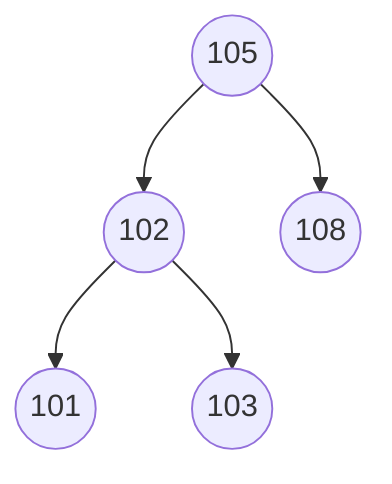

# DSA_project
# Public Transport Lost Item Recovery System

A menu-driven C program that manages lost-and-found items on public transport.
Staff record items found on buses and at stations, passengers search for their
items and file claims, and an admin processes the claims one by one in the order
they were filed.

**Course:** Data Structures and Algorithms, APJ Abdul Kalam Technological University (KTU), 2024 Scheme
**Language:** C
**Source file:** `lost_item_recovery.c`

---

## Table of Contents

1. [Data Structures Used](#1-data-structures-used)
2. [Features](#2-features)
3. [How to Compile and Run](#3-how-to-compile-and-run)
4. [Code Organisation](#4-code-organisation)
5. [Module 1: Circular Queue](#5-module-1-circular-queue)
6. [Module 2: Singly Linked List](#6-module-2-singly-linked-list)
7. [Module 3: Binary Search Tree](#7-module-3-binary-search-tree)
8. [Module 4: Hash Table](#8-module-4-hash-table)
9. [How the Data Structures Work Together](#9-how-the-data-structures-work-together)
10. [Sample Run](#10-sample-run)
11. [Time Complexity](#11-time-complexity)
12. [Limitations and Future Scope](#12-limitations-and-future-scope)

---

## 1. Data Structures Used

One data structure is taken from each module of the syllabus.

| Module | Data Structure | What it stores | Why it is used |
|:---:|---|---|---|
| 1 | Circular Queue | Claim IDs waiting to be processed | Claims must be served first-come, first-served (FIFO) |
| 2 | Singly Linked List | Full record of every unclaimed item | Number of items is unknown and changes constantly |
| 3 | Binary Search Tree | Index on Item ID (points into the linked list) | Fast search: O(log n) on average instead of O(n) |
| 4 | Hash Table (linear probing) | Passenger details, keyed by claim ID | O(1) average lookup when a claim is processed |

---

## 2. Features

| Option | Action | User | Data structures involved |
|:---:|---|---|---|
| 1 | Report a found item | Staff | Linked List, BST |
| 2 | Search for an item by ID | Passenger | BST |
| 3 | View all unclaimed items | Anyone | Linked List |
| 4 | File a recovery claim | Passenger | BST, Hash Table, Queue |
| 5 | Process the next claim | Admin | Queue, Hash Table, BST, Linked List |
| 6 | Exit | – | – |

Built-in validations:

- Duplicate Item IDs and duplicate pending Claim IDs are rejected.
- A claim is accepted only if the claimed item exists.
- If two passengers claim the same item, the first claim is approved and the later one is rejected.
- Only positive integers are accepted as IDs and menu choices.
- Names are limited to 49 characters to prevent buffer overflow.
- The program checks for a full queue and a full hash table.

---

## 3. How to Compile and Run

**Linux / macOS**

```bash
gcc lost_item_recovery.c -o lost_item
./lost_item
```

**Windows (MinGW)**

```bash
gcc lost_item_recovery.c -o lost_item.exe
lost_item.exe
```

The program can also be run in Code::Blocks or Dev-C++ by opening the file and
choosing Build & Run.

---

## 4. Code Organisation

The source file is divided into numbered sections.

| Section | Contents | Functions |
|:---:|---|---|
| 0 | Header files, constants, input helper | `readInt()` |
| 1 | Module 1: Circular Queue | `enqueue()`, `dequeue()` |
| 2 | Module 2: Singly Linked List | `insertItem()`, `deleteItem()`, `displayItems()` |
| 3 | Module 3: Binary Search Tree | `insertBST()`, `searchBST()`, `deleteBST()` |
| 4 | Module 4: Hash Table | `searchHash()`, `insertHash()` |
| 5 | System operations | `reportItem()`, `searchItem()`, `fileClaim()`, `processClaim()` |
| 6 | Main function | `main()` (menu driver) |

Constants:

| Constant | Value | Meaning |
|---|:---:|---|
| `LEN` | 50 | Maximum length of a name (49 characters + `'\0'`) |
| `MAX_QUEUE` | 50 | Maximum number of pending claims |
| `HASH_SIZE` | 53 | Hash table size (a prime number, larger than `MAX_QUEUE`) |

---

## 5. Module 1: Circular Queue

### Purpose

The queue holds the **claim IDs** of passengers waiting for their items. It
follows **FIFO (First In, First Out)**: the passenger who filed first is
served first, just like a queue at a ticket counter.

The queue stores **only claim IDs** (integers). The passenger's details are
kept in the hash table under the same claim ID, much like a token number at a
bank that is used to pull up your full record.

### Why circular?

In a linear array queue, slots freed at the front by `dequeue` can never be
reused, so the queue can report "full" while it is mostly empty. A circular
queue wraps the rear back to index 0 using the modulo operator.

```
Example with 5 slots: claims 501 and 502 were served,
then 506 arrived and the rear wrapped around to index 0.

  index:    0       1       2       3       4
         +-------+-------+-------+-------+-------+
         |  506  |       |  503  |  504  |  505  |
         +-------+-------+-------+-------+-------+
             ^               ^
            rear           front

  rear = (rear + 1) % MAX_QUEUE   ->   (4 + 1) % 5 = 0
```

### Variables

```c
int queue[MAX_QUEUE];   // claim IDs
int front = 0;          // index of the next claim to serve
int rear  = -1;         // index of the last claim added
int count = 0;          // number of claims waiting
```

`count` makes the checks simple: empty when `count == 0`, full when
`count == MAX_QUEUE`.

### Operations

| Function | Steps |
|---|---|
| `enqueue(x)` | `rear = (rear + 1) % MAX_QUEUE`, store `x` at `queue[rear]`, `count++` |
| `dequeue()` | take `queue[front]`, `front = (front + 1) % MAX_QUEUE`, `count--`, return it |

Overflow is checked in `fileClaim()` and underflow in `processClaim()` before
these functions are called.

---

## 6. Module 2: Singly Linked List

### Purpose

The linked list is the **master storage** of all unclaimed items. Each node
holds the item's ID and name. New items are inserted at the head, so the list
shows the most recently reported item first, like a daily logbook.

```
head
 |
 v
+-----+------------+---+    +-----+----------+---+    +-----+--------------+------+
| 108 | Laptop Bag | *-+--->| 102 | Umbrella | *-+--->| 105 | Black Wallet | NULL |
+-----+------------+---+    +-----+----------+---+    +-----+--------------+------+
  id     name       next
```

### Why a linked list and not an array?

- The number of found items is unknown; a linked list grows and shrinks with `malloc` and `free`.
- Insertion at the head is O(1).
- Deletion only changes one pointer; no elements need to be shifted.

### Deletion (removing item 102)

```
Before:  head -> [108] -> [102] -> [105] -> NULL
                  prev     cur

         prev->next = cur->next;   free(cur);

After:   head -> [108] ---------> [105] -> NULL
```

---

## 7. Module 3: Binary Search Tree

### Purpose

The BST is an **index on Item ID**. Each tree node stores the item ID and a
**pointer to the item's record in the linked list**, so every item's data is
stored only once. It works like the index at the back of a textbook.

```c
struct TreeNode {
    int id;                  // key used for comparison
    struct Item *item;       // points to the node in the linked list
    struct TreeNode *left;   // smaller IDs
    struct TreeNode *right;  // larger IDs
};
```

**BST property:** for every node, all IDs in the left subtree are smaller and
all IDs in the right subtree are larger.

### 7.1 Insertion

Items reported in the order **105, 102, 108, 101, 103**:

```
Insert 105      Insert 102      Insert 108      Insert 101      Insert 103

   105             105             105             105              105
                   /               /   \           /   \           /    \
                 102             102    108      102    108      102     108
                                                 /               /  \
                                               101             101   103
```

Final tree:

```
            105
           /    \
        102      108
       /   \
     101    103
```

The same tree in Mermaid graph notation (renders on GitHub):



### 7.2 Searching

**Search for 103** (found in 3 comparisons):

```
            [105]          Step 1: 103 < 105  ->  go left
           /     \
        [102]     108      Step 2: 103 > 102  ->  go right
       /     \
     101     [103]         Step 3: 103 = 103  ->  FOUND
```

**Search for 110** (not found):

```
            [105]          Step 1: 110 > 105  ->  go right
           /     \
        102      [108]     Step 2: 110 > 108  ->  go right
       /   \        \
     101   103      NULL   Step 3: reached NULL  ->  NOT FOUND
```

### 7.3 Deletion

When an item is handed over to its owner, it is removed from the BST so that
nobody else can find or claim it. There are three cases.

**Case 1: Node is a leaf (no children).** Delete 101: simply remove it.

```
            105                           105
           /    \                        /    \
        102      108        -->       102      108
       /   \                             \
     101    103                          103
```

**Case 2: Node has one child.** Delete 102 (its only child is 103): the child
moves up to take its place.

```
            105                           105
           /    \                        /    \
        102      108        -->       103      108
           \
           103
```

**Case 3: Node has two children.** Delete 105 from the tree below. Find the
**inorder successor** (the smallest node in the right subtree: go right once,
then keep going left), which is **106**. Copy 106 into the node being deleted,
then delete the original 106 (which is a Case 1 or Case 2 node).

```
Tree before (successor path: 105 -> 108 -> 106)

              105
            /     \
         102       108
        /   \     /   \
      101   103 106   110

Tree after deleting 105

              106
            /     \
         102       108
        /   \         \
      101   103       110
```

The successor is used because it is the next value larger than the deleted
one, so the BST property still holds everywhere.

### 7.4 Worst case: skewed tree

If items are reported with IDs in increasing order (101, 102, 103, 104), every
new node goes to the right and the tree becomes a straight line. Search then
takes O(n), the same as a linked list.

```
  101
     \
     102
        \
        103
           \
           104
```

A self-balancing tree such as an **AVL tree** would prevent this (see Future Scope).

---

## 8. Module 4: Hash Table

### Purpose

The hash table stores the **details of each claimant**: claim ID, item ID
being claimed, and passenger name. When the admin dequeues a claim ID, the
details are found in O(1) average time.

- **Hash function:** `index = claimId % HASH_SIZE` (HASH_SIZE = 53)
- **Collision handling:** linear probing (try the next slot, wrapping around)
- **Slot states:** `EMPTY`, `OCCUPIED`, `DELETED`

### Example with collision

Claims 501, 502 and 554 are filed:

```
501 % 53 = 24   ->  slot 24 empty            ->  stored at 24
502 % 53 = 25   ->  slot 25 empty            ->  stored at 25
554 % 53 = 24   ->  24 taken, 25 taken, 26   ->  stored at 26

 index   state       claimId   itemId   name
+-------+----------+---------+--------+--------+
|  ...  |          |         |        |        |
|  24   | OCCUPIED |   501   |  105   | Anu    |
|  25   | OCCUPIED |   502   |  102   | Rahul  |
|  26   | OCCUPIED |   554   |  108   | Meera  |   <- placed after probing
|  ...  |          |         |        |        |
+-------+----------+---------+--------+--------+
```

### Why a DELETED state (tombstone)?

After a claim is processed, its slot is marked `DELETED` instead of `EMPTY`.
If slot 25 were set back to `EMPTY`, a search for 554 would start at 24, reach
the empty slot 25 and wrongly stop with "not found". A `DELETED` slot tells the
search to keep probing, while an insert is still allowed to reuse it.

The table is a global array, so C initialises every slot to 0, which equals
`EMPTY`. No separate initialisation function is needed.

---

## 9. How the Data Structures Work Together

**Reporting an item (option 1)**

```
Staff enters ID + name
      |
      v
searchBST()  -- ID exists? --> reject duplicate
      |
      v
insertItem()  (Linked List stores the record)
      |
      v
insertBST()   (BST stores ID + pointer to that record)
```

**Filing a claim (option 4)**

```
Passenger enters Claim ID, Item ID, name
      |
      v
searchHash()  -- claim already pending? --> reject
      |
      v
searchBST()   -- item not found? --> reject
      |
      v
insertHash()  (details stored in Hash Table)
      |
      v
enqueue()     (only the Claim ID joins the Queue)
```

**Processing a claim (option 5)**

```
dequeue()       -> oldest Claim ID          (Queue: fairness)
      |
      v
searchHash()    -> passenger details         (Hash Table: fast lookup)
      |
      v
searchBST()     -> is the item still here?   (BST: fast search)
      |
      +-- no  --> REJECTED (already handed over)
      |
      +-- yes --> APPROVED
                    deleteBST()   (remove from index)
                    deleteItem()  (remove record from list)
      |
      v
Mark hash slot DELETED
```

---

## 10. Sample Run

```
===== LOST ITEM RECOVERY SYSTEM =====
1. Report Found Item
2. Search Item
3. View All Items
4. File Claim
5. Process Next Claim
6. Exit
Enter choice: 1

Enter Item ID: 105
Enter Item Name: Black Wallet
Item 105 added.

Enter choice: 1

Enter Item ID: 102
Enter Item Name: Umbrella
Item 102 added.

Enter choice: 2

Enter Item ID: 102
Found -> ID: 102 | Item: Umbrella

Enter choice: 4

Enter Claim ID: 501
Enter Item ID being claimed: 105
Enter Passenger Name: Anu
Claim 501 added to queue.

Enter choice: 4

Enter Claim ID: 502
Enter Item ID being claimed: 105
Enter Passenger Name: Rahul
Claim 502 added to queue.

Enter choice: 5

Claim 501 | Passenger: Anu | Item ID: 105
APPROVED: 'Black Wallet' handed over.

Enter choice: 5

Claim 502 | Passenger: Rahul | Item ID: 105
REJECTED: item already handed over.

Enter choice: 3

ID      Item
102     Umbrella

Enter choice: 6
```

(The menu is printed before every `Enter choice:` prompt; it is shown only
once above to save space.)

---

## 11. Time Complexity

| Data Structure | Operation | Average | Worst |
|---|---|:---:|:---:|
| Circular Queue | Enqueue / Dequeue | O(1) | O(1) |
| Linked List | Insert at head | O(1) | O(1) |
| Linked List | Delete by ID | O(n) | O(n) |
| Linked List | Display all | O(n) | O(n) |
| Binary Search Tree | Insert / Search / Delete | O(log n) | O(n) (skewed tree) |
| Hash Table | Insert / Search | O(1) | O(n) (many collisions) |

---

## 12. Limitations and Future Scope

- **Skewed BST:** sequential IDs make the tree a straight line. An AVL or Red-Black tree would keep operations at O(log n).
- **No permanent storage:** all data is lost when the program exits. Saving records to a file would fix this.
- **Fixed limits:** the queue holds 50 claims and the hash table 53 entries. Dynamic resizing could remove these limits.
- **Search by ID only:** passengers must know the item ID. Searching by item name or by bus route could be added.
- **No authentication:** anyone can choose the staff or admin options. Login roles could be added.
